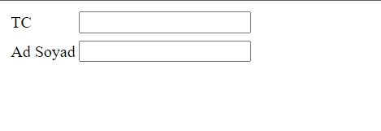
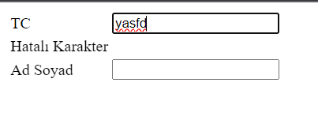
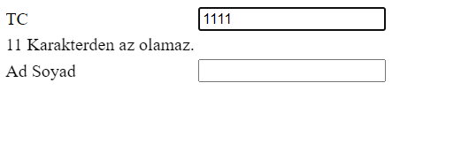
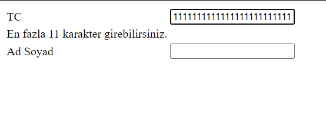

<h1><i>TRY CATCH</i></h1>

In this project, I used try-catch to display error messages for the identity number input field. If a textual expression is entered, an error message is displayed. Additionally, if fewer than 11 characters are entered, a warning stating "Cannot be less than 11 characters" is shown, and if more than 11 characters are entered, a warning indicating "Maximum of 11 characters allowed" is displayed.

